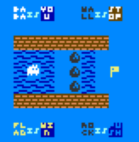

BABA IS C
---------

based on ideas from [Nick Bensema][BABA-IS-C64], [Arvi "Hempuli" Teikari][BABA-IS-YOU]

## Trivia

I've got a C64 on my birthday in August 2020, and at the same time I have played original game by Arvi.

Few months after I was thinking to learn this platform more. Writing a game was a great idea for this.
I thought about BABA immediately, as the game seems to be the perfect hit.

Obvs I've googled first, and I found the implementation on Commodore 64 BASIC. Unfortunately,

> The game runs, ... is too slow to actually play unless it is compiled. When it is compiled with Basic-BOSS, it is playable,

I wanted to make it faster. 
As a (mostly) build engineer, I started with building [a toolchain][BABA-IS-YOTTATSA] around the code to iterate faster.
Still, BASIC seemed to be a PITA. I ended up started rewriting it in portable C.

[BABA-IS-C64]: <https://github.com/unbibium/baba-is-c64>
[BABA-IS-YOU]: <https://www.hempuli.com/baba/>
[BABA-IS-YOTTATSA]: <https://github.com/yottatsa/baba-is-c64/blob/master/Makefile>
